  # Microservices Task - Dockerization of Node.js Microservices

  ## Objective

  The objective of this task was to containerize a Node.js microservices application using Docker and manage all services using Docker Compose.

  ## Repository Setup

  The original repository was forked from the provided GitHub repository and cloned locally for development.

  ### Fork Repository

  1. Open the provided GitHub repository.
  2. Click the **Fork** button in the top-right corner.
  3. Create a copy under your GitHub account.
  4. Clone the forked repository locally.

  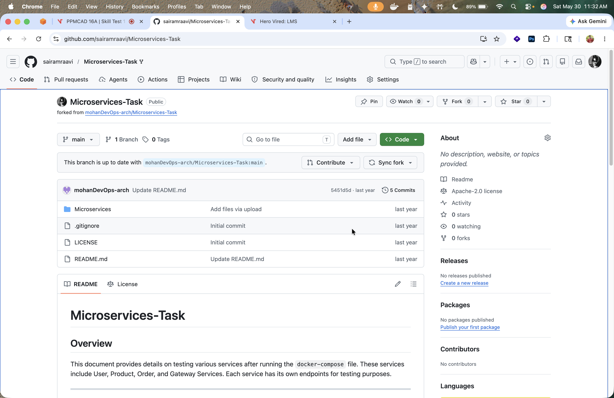

  ```bash
  git clone https://github.com/sairamraavi/Microservices-Task.git
  cd Microservices-Task
  ```

  A new branch was created for the Docker implementation:

  ```bash
  git checkout -b feature/microservice-docker
  ```

  ## Implementation

  The project contains the following services:

  * User Service (Port 3000)
  * Product Service (Port 3001)
  * Order Service (Port 3002)
  * Gateway Service (Port 3003)

  ### Dockerfiles

  A separate Dockerfile was created for each service.

  The Dockerfiles perform the following actions:

  * Use the Node.js Alpine image as the base image.
  * Set the working directory.
  * Copy package.json.
  * Install dependencies.
  * Copy application source code.
  * Expose the required port.
  * Start the service using:

  ```dockerfile
  CMD ["node","app.js"]
  ```

  #### User Service Dockerfile

  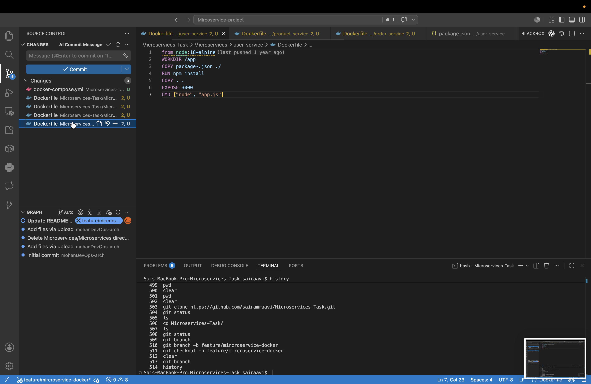

  #### Product Service Dockerfile

  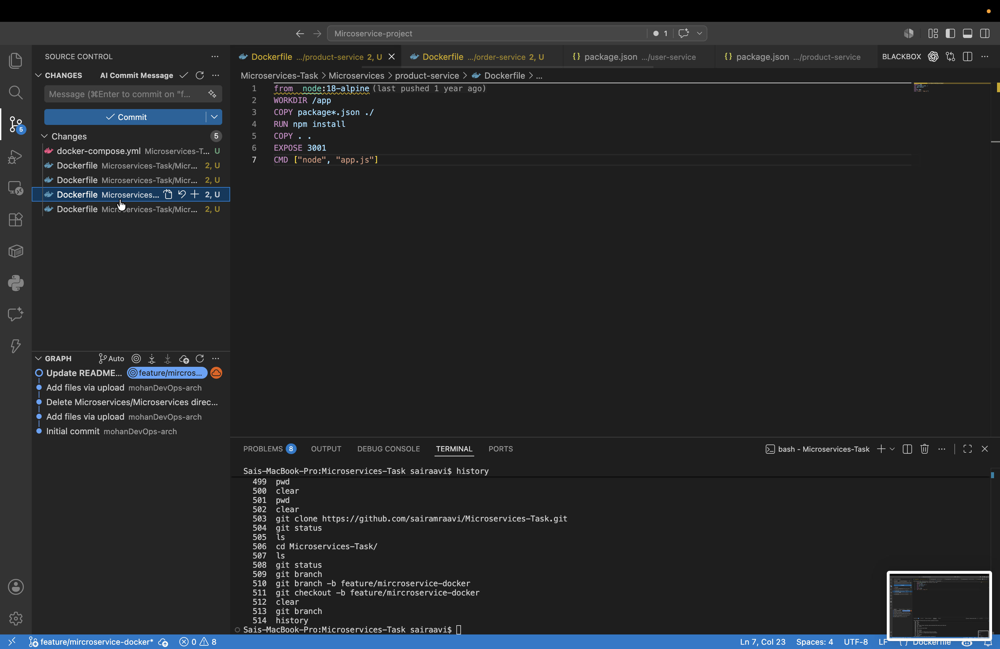

  #### Order Service Dockerfile

  

  #### Gateway Service Dockerfile

  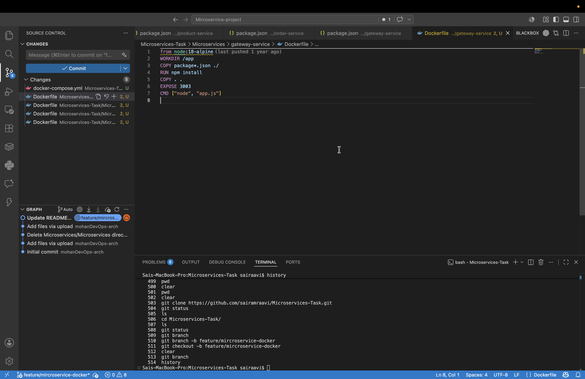

  ### Docker Compose Configuration

  A docker-compose.yml file was created to:

  * Build all services.
  * Start all containers together.
  * Map container ports to host ports.
  * Allow communication between services using Docker networking.

  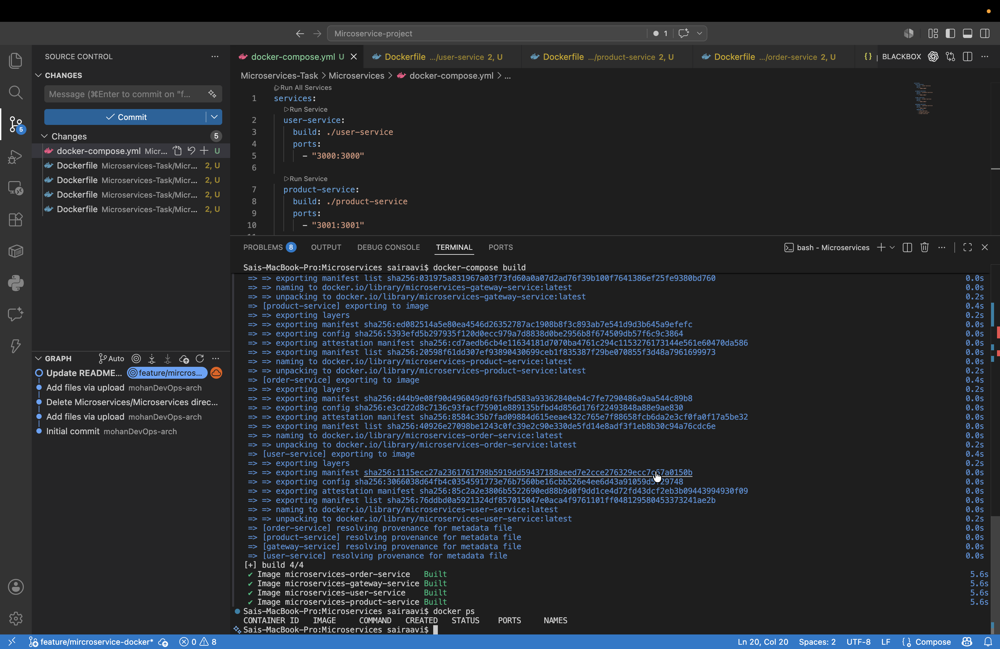

  ## Build and Run

  ### Build Images

  ```bash
  docker-compose build
  ```

  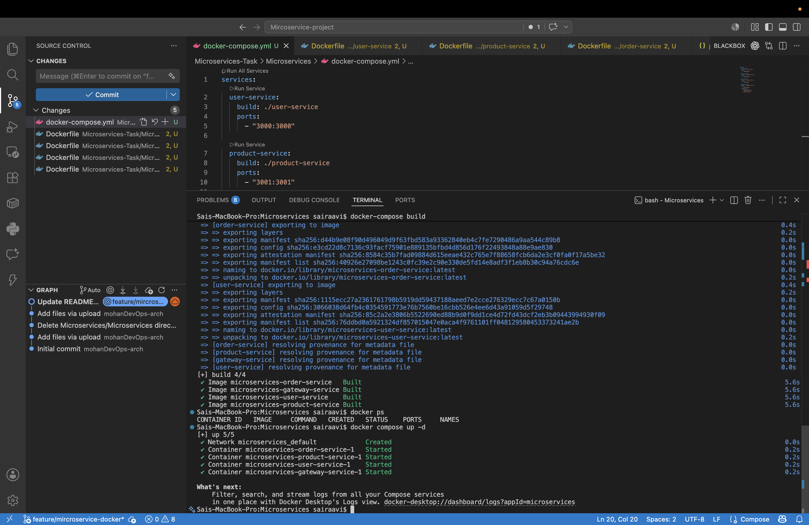

  ### Start Containers

  ```bash
  docker-compose up -d
  ```

  ### Verify Running Containers

  ```bash
  docker ps
  ```

  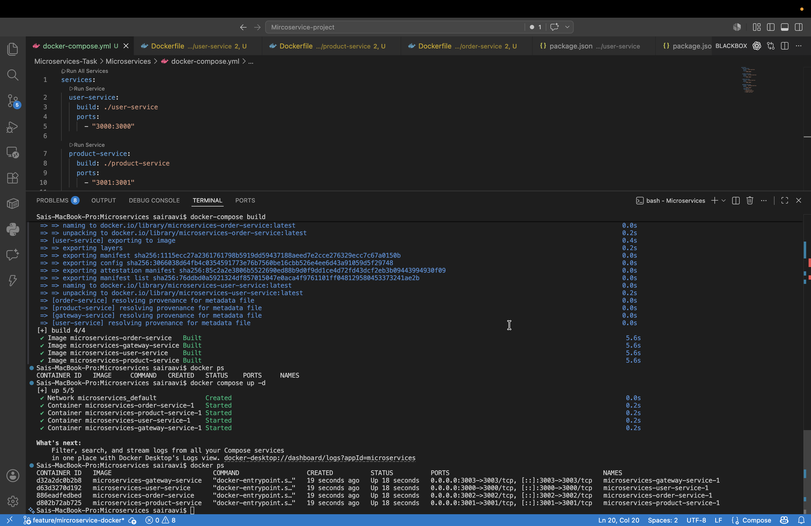

  All four containers were successfully created and started.

  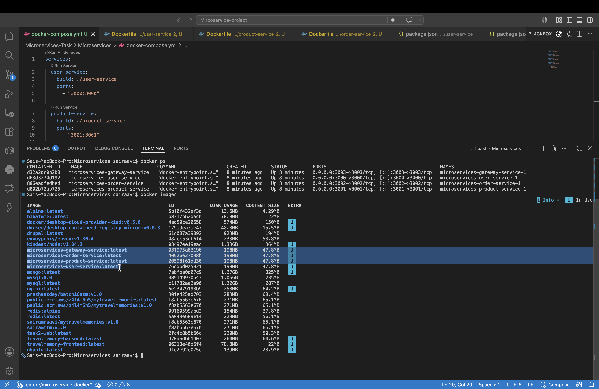

  ## Service Testing

  After the containers started successfully, the following endpoints were tested.

  ### User Service

  ```text
  http://localhost:3000/users
  ```

  Response:

  ```json
  [
    {
      "id": 1,
      "name": "John Doe"
    },
    {
      "id": 2,
      "name": "Jane Smith"
    }
  ]
  ```

  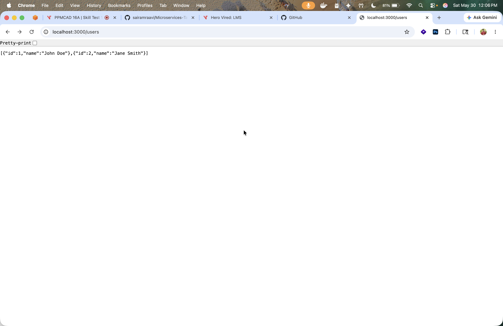

  ### Product Service

  ```text
  http://localhost:3001/products
  ```

  Response:

  ```json
  [
    {
      "id": 1,
      "name": "Laptop",
      "price": 999
    },
    {
      "id": 2,
      "name": "Phone",
      "price": 699
    }
  ]
  ```

  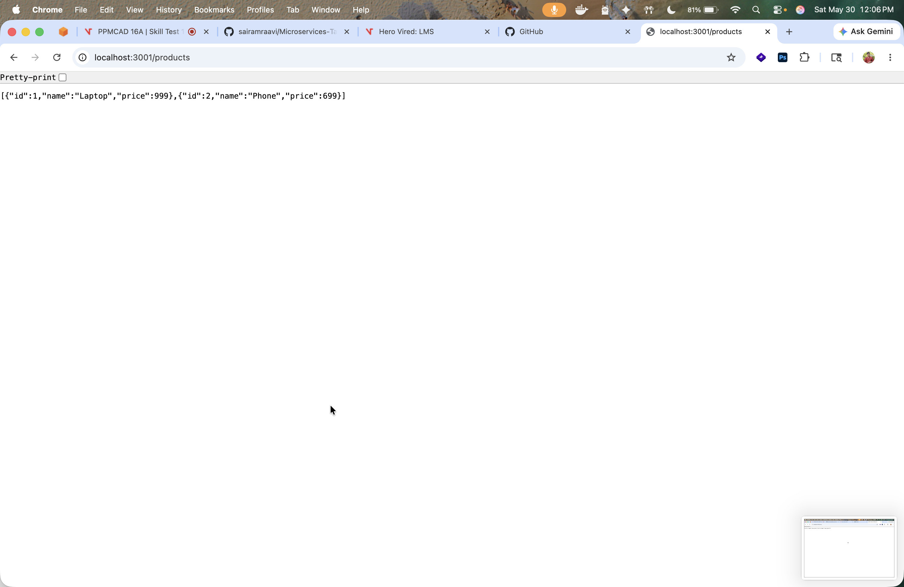

  ### Order Service

  ```text
  http://localhost:3002/orders
  ```

  Response:

  ```json
  []
  ```

  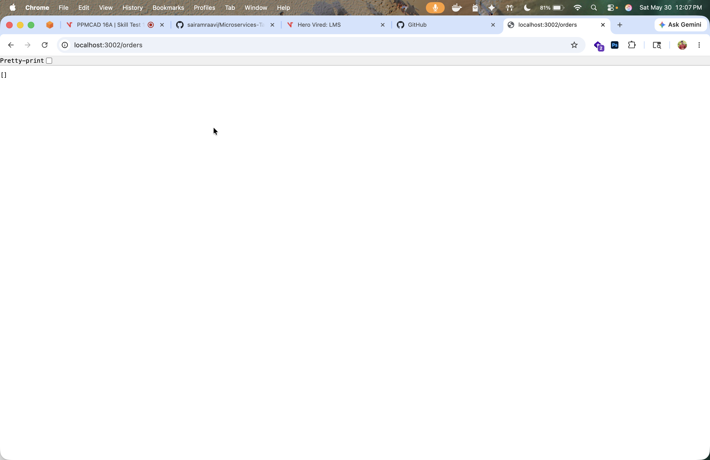

  ### Gateway Health Check

  ```text
  http://localhost:3003/health
  ```

  Response:

  ```json
  {
    "status": "Gateway Service is healthy"
  }
  ```

  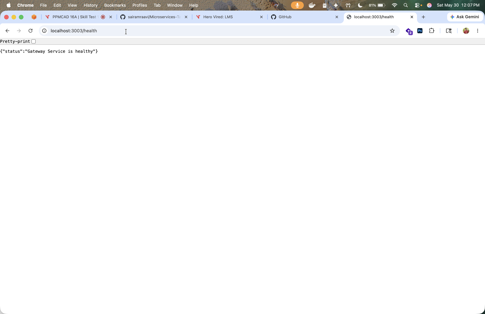

  ### Gateway Users API

  ```text
  http://localhost:3003/api/users
  ```

  The gateway successfully retrieved user data from the User Service.

  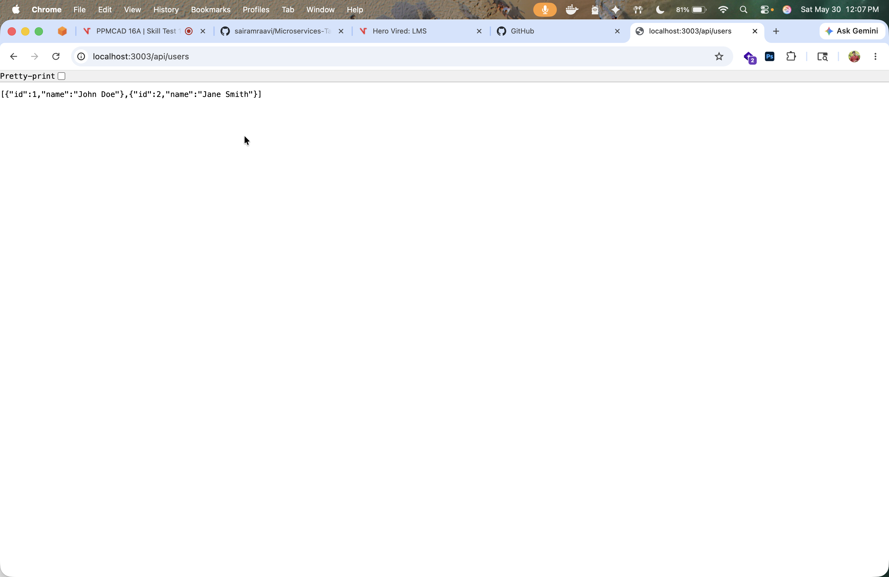

  ### Gateway Products API

  ```text
  http://localhost:3003/api/products
  ```

  The gateway successfully retrieved product data from the Product Service.

  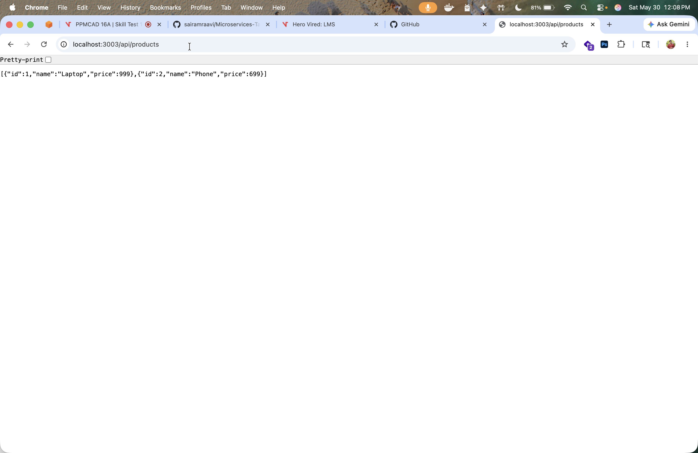

  ## Screenshots Included

  The following screenshots were captured during task completion:

  1. Forked GitHub repository.
  2. Dockerfile creation for User Service.
  3. Dockerfile creation for Product Service.
  4. Dockerfile creation for Order Service.
  5. Dockerfile creation for Gateway Service.
  6. Docker Compose configuration.
  7. Docker image build process.
  8. Docker containers running using docker-compose up.
  9. docker ps output showing running containers.
  10. User Service endpoint output.
  11. Product Service endpoint output.
  12. Order Service endpoint output.
  13. Gateway Health endpoint output.
  14. Gateway Users API output.
  15. Gateway Products API output.

  ## Troubleshooting

  If containers fail to start:

  ```bash
  docker-compose logs
  ```

  To stop all running containers:

  ```bash
  docker-compose down
  ```

  To rebuild after changes:

  ```bash
  docker-compose build
  ```

  ## Conclusion

  The Node.js microservices application was successfully containerized using Docker. Individual Dockerfiles were created for all services, and Docker Compose was used to build and run the complete application. All services were verified through their respective endpoints, and communication between services through the Gateway Service was successfully tested.
